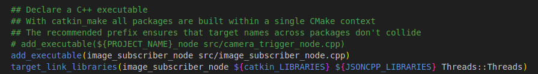

# papi
## Pino's Application Programming Interface - PAPI
A collection of C++ namespaces, classes, and functions designed for the automatic operation of services on a drone.
### Installation:
  Clone this repository in your local project.
```
git clone https://github.com/acsii-63/papi.git
```
### Usage:
<!--   - Utilizing this API in a similar manner to a C++ header file.
  - In the include path of your C++ program, add the following statement:
```
#include "/path-to-the-repository/papi/PAPI.h"
``` -->
  To properly utilize this API within a ROS package situated in a catkin workspace, it would be advisable to include the following elements within the CMakeLists.txt file:
```
# Add OpenCV
find_package(OpenCV REQUIRED)
include_directories(${OpenCV_INCLUDE_DIRS})

## Add JSONCPP dependency
find_package(PkgConfig REQUIRED)
pkg_check_modules(JSONCPP jsoncpp)

include_directories(${JSONCPP_INCLUDE_DIRS})
link_directories(${JSONCPP_LIBRARY_DIRS})

## Add pthread library
set(CMAKE_THREAD_PREFER_PTHREAD TRUE)
set(THREADS_PREFER_PTHREAD_FLAG TRUE)
find_package(Threads REQUIRED)
```
  And incorporate these elements in the target_link_libraries() function within the add_executable() section:
```
${JSONCPP_LIBRARIES}
${OpenCV_LIBRARIES}
Threads::Threads
```
Example:

<!--  -->
